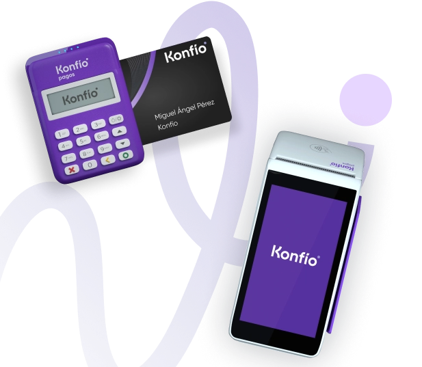
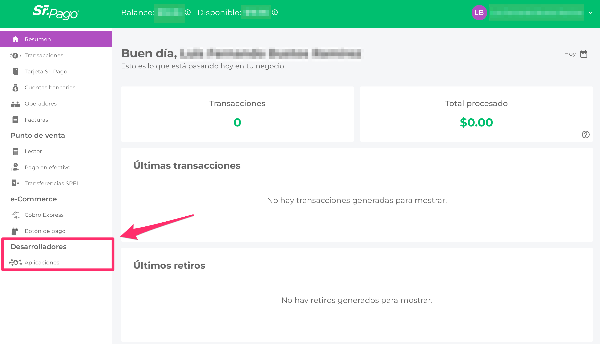
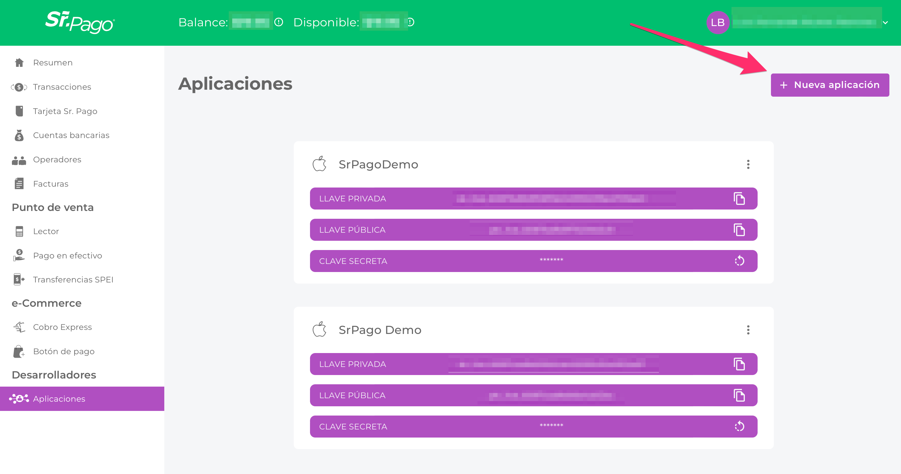
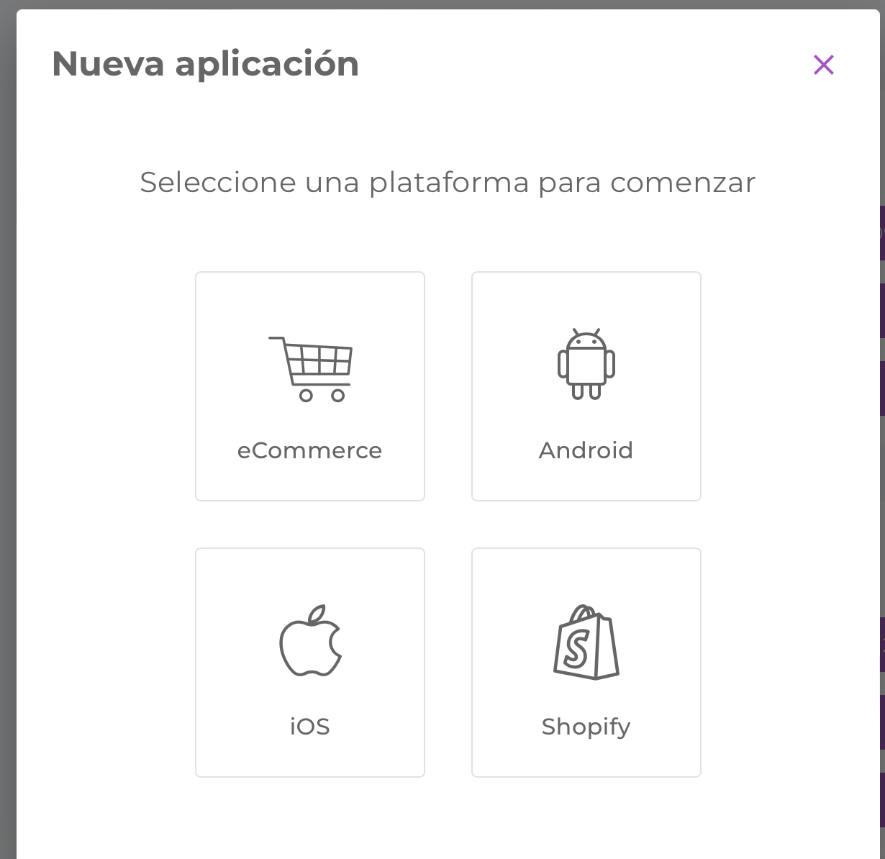
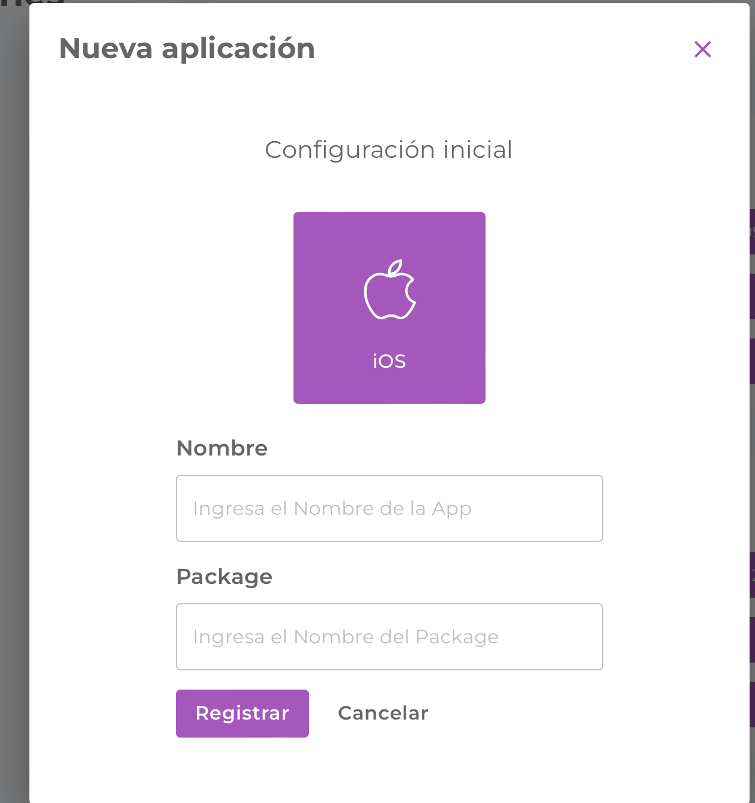
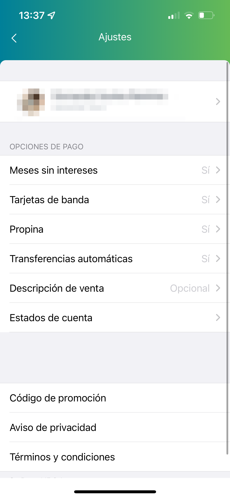
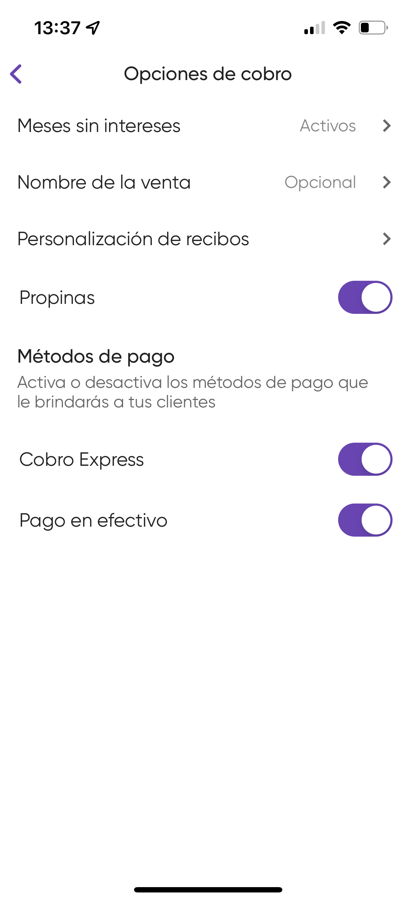

# SrPago-SDK



## Overview

The payment module SDK is a Framework developed by Sr.Pago/Konfío certified by PROSA VISA*, MASTERCARD* and AMERICAN EXPRESS*; thats allow to use ours current certified terminals (Pin pad* and Pin pad mini) to make transactions with MPOS payment (chip, contactless and band) in an easy and secure way.

If you have used one of our applications (Sr. Pago or Konfio), you’ll know the main workflow and behavior of this SDK and you can be sure that you and your customers' money will be safe.

> **Note:**  *These certifications probably still in progress so new update can be shared

<br>

## Requirements

- Xcode 13.*
- Swift 5
- Minimum iOS 11 version supported
- Cocoapods
- iPhones and iPads supported
- A Pinpad or Pinpad mini terminal
- You need to register your app in our [web portal](https://my.srpago.com/) to obtain your app key and app secret (we recommend you create one for development and another for production environments), these fields let you consume our web services and let us know which apps are using the SDK.
- You need a Sr.Pago/Konfío account to be logged into your application, you must register the user who will carry out these transactions, to know where we will deliver your money for all your movements.

<br>

## SDK Credentials

First you must register your app in [production](https://my.srpago.com/auth/login) or [sandbox](https://sandbox-my.srpago.com/auth/login), according to the environment you need.





Then you can create a desired app, in this case we will create an iOS app




 
# Implementation

To install the SDK you need to download it from GitHub through Cocopods or download it manually (in the Github repository you’ll find the latest version available).

```ruby
 pod 'SrPagoSDK', :git => 'https://github.com/srpago/srpago_pods.git ', :tag => '2.4.0'
```

For legacy support in SDK version we recommend you indicate the tag of your pod used

Once you have installed the SDK by Cocoapods, you need to import our main frameworks ```KNCore``` and ```KNPayment```

All main workflow is on ```KNPayment```, so all next method can be found in this class

We recommend you to use this SDK as a singleton and create a manager for it, because all linked terminals are associated with an only SDK instance, so this should cause bad behaviors when you try to start a transaction with a SDK instance without a linked terminal.

<br>

## Initialization

First of all you need to initialize the SDK passing your app key and app secret by:

```swift
/// Function to configure the environment, appkey and appsecret of your app, this method is necessary to be invoked before of start a transaction
/// - Parameter config: KNConfigurator with the params of your app
public func config(_ config: KNCore.KNConfigurator)
```
In case you have your SSO token you can consume this method without any appKey or appSecret in your KNConfigurator
 
<br>

## Login

After you have initialized your SDK you need to select the user who will transaction using the method:

```swift
/// Request the user token to start the payment
/// - Parameters:
///   - user: String with the email user
///   - password: String with the password
///   - completion: result of the api request
public func login(user: String, password: String, completion: @escaping (Result<Bool, KNCore.KNPaymentError>) -> Void)
```

Another option to avoid using your app key and app secret is to use your SSO (Single Sign On) token to use this SDK without needing to log in.

```swift
/// Setup custom authentication token
/// - Parameters:
///   - token: String with auth token
public func authenticateToken(_ token: String)
```
 
<br>

## Link a terminal

To start the search device functionality you need to call the below method and pass which class will be listener for pairing delegates methods, that tell you the terminals state and terminals found

```swift
/// Method that indicate which class will be in charge to manage the state of your bluetooth delegate
/// - Parameter delegate: class that implement KNBluetoothReaderDelegate
public func configBluetoothReaderState(delegate: KNCore.KNBluetoothReaderDelegate)
```

To initialize the terminals search you need to indicate which terminals you will use by ```searchDevices```, in case you need all kind of Konfio terminals you can omit this optional param

```swift
/// Method to start scanning device via bluetooth
/// As requirement previous to start this scanning, is have been added an NSBluetoothAlwaysUsageDescription description in your info.plist
/// - Parameters:
///   - devices: Optional list of the devices enable to vinculate, if this param is nil, all possible devices will be founded
public func searchDevices(_ devices: [KNCore.KNConnectionReaderType]?)
```

Each found terminal will be returned by this method as  found terminals list, if any terminal disappears will be notified with the same method.

We recommend to stop searching once your terminal was linked, to improve the battery performance. 

```swift
/// Stop searching devices and reset list of founded devices
public func stopSearchDevices()
```   

To link to an specific terminal, you must pass it by this method:

```swift
/// Function that connect with reader indicated
/// - Parameter bluetooth: reader
public func connectReader(_ reader: KNCore.KNBluetoothReader)
```   

> **Tip:** For the last paired terminal, you can try reconnect it with this method that will try to reconnect with your terminal during 30 seconds lapse; in case that can be paired, you will be notified by method:

```swift
/// Method that validate if a previous terminal was paired and can be reconnected
/// - Returns: flag indicated reconnection posible
public func canReconnect() -> Bool
```

```swift
/// Function to try to connect with your last linked reader, just work if you  have a previously linked reader
public func tryReconnect() 
```
 
<br>

## Terminal

If you need to get you terminal’s information, you can use the method:

```swift
/// Method to request all info of your reader connected, avoid consume this method once a transaction is working because terminals can only process one command at a time
/// - Returns: Optional reader information
public func getReader(info: @escaping(KNReaderInfo) -> Void, error: @escaping(KNPaymentError) -> Void)
```
> **Note:**  You should be careful when this method is called when a transaction is in progress because the terminal can only process one command at a time, so you may receive an error on this method or your transaction.

To know if you still connected with your terminal can use:

```swift
/// Check the connection of the current reader
public func validateConnection() -> Bool
```

To disconnect your terminal, or try to connect with another terminal you need to use disconnectReader method to do that:

```swift
/// Function to disconnect your last reader vinculated, just work if you have a previously linked reader
public func disconnectReader()
```
 
<br>

## Make a transaction

To start a transaction is straightforward as consume the method and indicates the class that be responsive for delegation, in this class you will receive your transaction workflow and will be notified if any additional information is needed

```swift
/// This method starts a transaction with a previously linked reader, any state of your transaction will be notified by KNPaymentDelegate
/// - Parameters:
///   - amount: quantity of money (MXN) to be charged
///   - reference: description of you sale
///   - delegate: class that will be notified of any state of your transaction
public func makePayment(amount: String, reference: String?, delegate: KNCore.KNPaymentDelegate)
```

Most common information required to make a transaction is the tip that your customer wants to give you

```swift
/// Function where the amount of money that will be added in your transaction as a tip will be indicated
/// - Parameter tip: float with quantity of money as tip, this tip need to be less as 30% of total amount, if you indicate a bigger quantity, you will be notify by  KNPaymentDelegate by his onPaymentError function
public func setTip(_ tip: Float)
```
> **Note:** This tip can’t be bigger than 30% of your transaction amount.

You will be notified if tip is available if receive the method  ```func onRequestTips()``` from your ```KNPaymentDelegate```


Other common requirement are the installments you want to split your transaction, in this case you will receive a list of possibles months available: if you can split your transaction in partialities, just need to indicate the number of months you want

```swift
/// Method where the number of months that this payment will be made will be indicated
public func selectMonth(_ month: KNPaymentMonth)
```    

```swift
/// Method that indicate you will pay in one exibition
public func selectPayInOneExibition()
```

You will be notify if months are available if receive the method  ```func onMonthsAvailable(months: [KNPaymentMonth])``` from your ```KNPaymentDelegate```

We are working to add the payment in one exhibition in this list, for a while if you want to pay in one exhibition please consume the method passing 0 or 1 month as number of installments availables

> **Note:** The number of months available are defined by your settings and  the availability with inserted card bank, therefore in some cases you couldn’t retrieve the  full installments list.

The next transaction step is to request signature or nip for your card, to know which one will be in charge by our SDK, but you will be notified with payment’s state by ```func onPaymentCurrentState(state: KNPaymentState)``` from your ```KNPaymentDelegate```

The transaction’s final state will be received by ```func onPaymentSucess(result: KNPaymentResult)``` from your ```KNPaymentDelegate``` where you can find information as transaction Id in case you need to print a receipt.

In the last case you can be notified by ```func onPaymentError(error: KNPaymentError)``` if any error occurs, you can find the reason, and a brief resume of payment error.


According to certification guidelines we suggest showing the error messages to your users through ```KNPaymentError.errorLocalizedDescription``` because some messages are needed for compliance. 

> **Note:** For certification we recommend you inform the error to your users with ```KNPaymentError.errorLocalizedDescription``` because some message are needed for security and PCI
 
<br>

## List of movements and detail

To get a movements list made by your users, just need to consume the below method to get a movement list with their current states, if you need more info you can use the method by passing the transaction id

```swift
/// This function get the last transactions maded by your account
/// - Parameters:
///   - offset: index of last transtraction to be request
///   - limit: max number of transactions
///   - completion: optional list of operations
public func getTransactions(offset: Int, limit: Int, completion: @escaping ([KNCore.KNOperation]?) -> Void)
```   
 
<br>

## Print or send a voucher

If you want to send a voucher through sms or email, just need to consume the method to indicates the transaction id and how you want to send this movement
 

```swift
/// Method to send a operation selected by email or sms method
/// - Parameters:
///   - transactionId: transaction Id of the transaction to be refound
///   - type: sms or email way
public func sendTicketBy(transactionId: String, type: KNCore.SendPrinterType, destination: String, completion: @escaping (Bool) -> Void)
```

To print any voucher, you need some special parameters to be certified, so Konfio added an easy way to get it, just need to consume the method by passing the transaction id or an operation of your movements list

```swift
/// Function to print get a KNRecipe from transaction
/// - Parameter transaction: transaction to print
public func getTicketFrom(transaction: KNCore.KNPaymentResult, completion: @escaping (Result<KNCore.KNRecipe, KNCore.KNPaymentError>) -> Void)
````

```swift
/// Function to print get a KNRecipe from transaction
/// - Parameter operation: operation of print
public func getTicketFrom(operation: KNCore.KNOperation, completion: @escaping (Result<KNCore.KNRecipe, KNCore.KNPaymentError>) -> Void)
```

With this method you will receive a PDF that can be shared as you want

```swift
/// Function to print Recipe by bluetooth, to use this method you need to be linked with a printer previously
/// - Parameter data: Array of Data, you can create it using KNBluetoothTicketHelper
/// - Returns: Optional error connection
public func printRecipeByBluetooth(data: [Data]) -> KNCore.KNPaymentError?
```
```swift
/// Function to create Recipe as data array
/// - Parameter recipe: recipe to be printer
/// - Returns: Optional Array of Data, you can create it using KNBluetoothTicketHelper
public func createWifi(recipe: KNCore.KNRecipe) -> [Data]?
```
```swift
/// Function to print Recipe by wifi with native iOS printer
/// - Parameter data: Array of Data, you can create it using KNPdfTicketHelper
public func printRecipeByWifi(data: [Data])
``` 
 
<br>

## Refund 

In some cases your customers will request for a payment refund, in that case you need use the method:

```swift
/// This function will make a refund for the indicated transaction, it is necessary that this transaction has been made on the current day, otherwise KNPaymentDelegate will notify it through its onPaymentError function
/// - Parameter transactionId: transaction Id of the transaction to be refund
public func makeRefund(transactionId: String, completion: @escaping (String?) -> Void)
```
> **Note:** Refunds can only be made if your refund is made on the same day as your payment, otherwise you need to contact us for a solution.
 
 <br>

## Customization

One important step of a transaction is to authenticate the card holder, and that's the importance of making a signature. If you wish to customize the UI, you can use this method:

```swift
/// Function that configure signature view detail with custom colors and water mark
/// - Parameter viewData: KNSignatureViewData with params for signature representation
public func configSignatureUI(_ viewData: KNCore.KNSignatureViewData)
```

Within you can customize parameters as orientation, colors, font or water marks.

Other possible customization is to indicate if you are enabled to receive tips or installments available, at the moment these fields aren’t available in the SDK, but you can use Konfío or SrPago app to indicate that




<br>

## Upgrade terminal

As any technology, this will receive changes and improves occasionally, so we’ll give you a way to update your terminals to support all market cards, to start any update you can verify if we have a new update available for you terminal

```swift
/// Verify if your terminal has an update available
/// - Parameter needUpdate:flag that indicate if we have an update for your terminal
public func checkOtaUpdate(needUpdate: @escaping ((Bool) -> Void))
```

In case we have, you can start the upgrade with method and know how to implement with the delegate that informs the progress, and if it has finished with success or error

```swift
/// Method that start your terminal update 
/// - Parameter delegate: class where you will be notify of the state of his terminal update
public func startOtaUpdate(delegate: KNCore.KNUpdateOtaDelegate)
```

If you need to cancel this update and start again in other moment you can use ```cancelOta``` method to do that

```swift
/// Method that let you stop or cancel you update in case you wish to do that in other moment
public func cancelOtaUpdate()
```

To support updates in background is needed to indicate these behavior in your info.plist in background mode sections

```plist
<key>UIBackgroundModes</key>
<array>
   <string>bluetooth-central</string>
   <string>fetch</string>
</array>
```

If you don't want to support these behavior we recommend to disconnect your ```KNUpdateOtaDelegate``` once your app goes to background using ```removeOtaDelegate``` and ```cancelOtaUpdate```

```swift
/// Method that remove the delegate class where you will be notify, this method let you be safe of memory leeks
public func removeOtaDelegate()
```

<br>

# Resume

KNPayment framework has all needed steps to make a transaction, from search terminals to print your voucher. With this SDK you can be sure all your transactions are secure

 <br>

# Next steps and coming soon

At this moment, this SDK just have business logic, we are working to give you a SDK with UI pre charged to make easy and quickly any implementation you need
 
<br>

# More info and feedback 

For any question you can comunícate with our support team, or even with our Product Manager Sergio Carballo at sergio.carballo@konfio.mx 

Or use our [demo project](Example/) as reference
 
<br>

# ChangeLog

## [2.11.1] 2022-09-22

### Fixed
- Commissions order

## [2.11.0] 2022-09-21

### Added
- Function to get user fees
- New logs for terminals
- Documentation macros

## [2.10.0] 2022-09-15

### Added
- Adding cashPayment into monthly installments array to get dynamic comission

### Changed
- Some variables reported in NR analytics 

## [2.9.0] 2022-08-18

### Added
- Vinculation improves and new states

## [2.8.0] 2022-06-15

### Added
- Tip label in signature view

## [2.7.0] 2022-06-15

### Added
- No internet connection was validated

## [2.6.0] 2022-06-15

### Added
- New OTA endpoint

## [2.5.2] 2022-06-02

### Added
- Cancel transaction in BBPOS terminal by payment state
- Improve vinculation report

### Bugfix
- Reader vinculation 

## [2.5.1] 2022-05-20

### Added
- Cancel transaction in BBPOS terminal if card discovery still in progress

## [2.5.0] 2022-05-19

### Added
- Demo integrated
- Cancel transaction
- Received amount in installments

### Improves
- Some warnings were solved
- Analytics report for transaction error

### Changed
- Readme was updated with SDK's documentation

## [2.4.0] 2022-04-27

### Added
- Get user email when his SSO token was added

## [2.3.0] 2022-04-27

### Added
- OTA improvements 

## [2.2.1] 2022-04-21

### Added
- OTA Update

## [2.1.1] 2022-03-23

### Bugfix
- Error launched if turn off your reader when transaction was finished

## [2.1.0] 2022-03-18

### Changed
- Singleton was removed from kNPayment

## [2.0.14] 2022-03-17

### Changed
- Build with build library for distribution

## [2.0.13] 2022-03-16

### Changed
- Build with swift 5.6

## [2.0.12] 2022-03-12

### Changed
- Signature header height can be configurated

#### Fixed
- Double error thrown when configuration service has an error

## [2.0.11] 2022-03-10

### Changed
- AppKey and AppSecret will be changed to optionals

## [2.0.10] 2022-03-08

### Removed
- Unnecessary reader states callbacks

## [2.0.9] 2022-03-08

### Changed
- Reader info was improved

#### Added
- Validation of location enable

## [2.0.8] 2022-03-03

### Changed
- Vinculation was improved, now turn off readers will be dissapear from vinculation list

## [2.0.7] 2022-03-03

### Changed
- Signature UI Configuration

## [2.0.6] 2022-03-02

### Added
- OTA Update

## [2.0.5] 2022-02-28

### Added
- Signature UI Configuration

## [2.0.4] 2022-02-28

### Fixed
- Reader state was fixed when reader was linked from try to reconnect without previous descovery
 
## [2.0.2] 2022-02-25

### Fixed
- Fix publish on app store

## [2.0.1] 2022-02-21

### Changed
- Build library for distribution was disable

## [2.0.0] 2022-02-02

### Added
- New Framework version
- Simulator support

## [1.2.0] 2022-02-01

### Added
- New environments support
- Battery report was improved

## [1.1.9] 2022-01-06

### Added
- PAX vinculated info was improved

### Changed
- Support for Xcode 13 and iOS 15
- Minimum iOS version was changed to 11

## [1.1.8] 2021-09-11

### Added
- Adding MSI value on Receipt
- Refound consume service

### Changed
- Brand card BBPOSManager
- Update headers according to environment
- Reader time transaction was changed from 120 seconds to 30 from BBPOS Reader

### Fixed
- Logging the 'SUCCESS' status on transacation
- Null value crash in PAX print
- Validating empty fields of address to avoid show wrong string address

## [1.1.7] 2021-08-31

### Added
- Transaction web service, return transactions values
- Add ISO field in Bluetooth and WIFI ticket
- Reference field is now limited to 20 characters
- Headers for each web service
- Decrypt Method for base url

### Fixed
- Generic Printer works again

### Removed
- Old Readers were removed

## [1.1.6] 2021-07-15

### Added

- Master Card **Sonicbrand** Sound
- Unit Tests

### Removed
- Unusable class was removed
